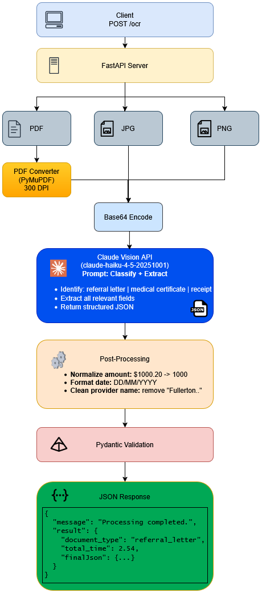

# OCR Document Processing Service

[](https://github.com/darinatic/OCR_Assignment/actions/workflows/test.yml)

A FastAPI microservice that accepts medical documents (PDF/images), automatically classifies them, and extracts structured data for downstream claim adjudication using Claude Vision API.



## Quick Start

Install dependencies:
```bash
pip install -r requirements.txt
```

Configure your API key:
```bash
cp .env.example .env
```

Edit `.env` and add your Anthropic API key:
```
ANTHROPIC_API_KEY=<paste your api key starting with sk..>
```

Start the server:
```bash
uvicorn main:app --reload
```

Test with a sample document:
```bash
curl -X POST http://localhost:8000/ocr -F "file=@samples/referral_letter.pdf"
```
```bash
curl -X POST http://localhost:8000/ocr -F "file=@samples/medical_certificate.pdf"
```
```bash
curl -X POST http://localhost:8000/ocr -F "file=@samples/receipt.pdf"
```
```bash
curl -X POST http://localhost:8000/ocr -F "file=@samples/unsupported.pdf"
```
```bash
curl -X POST http://localhost:8000/ocr -F "file=@samples/invalid.txt"
```

## API

**Endpoint**: `POST /ocr`

**Request**: Multipart form with `file` (PDF, JPEG, or PNG)

**Response**:
```json
{
  "message": "Processing completed.",
  "result": {
    "document_type": "referral_letter",
    "total_time": 2.54,
    "finalJson": {
      "claimant_name": "John Doe",
      "provider_name": "ABC Clinic",
      "signature_presence": true,
      "total_amount_paid": 3000000,
      "total_approved_amount": 3000000,
      "total_requested_amount": 3000000
    }
  }
}
```

**Errors**: `400` (file_missing), `422` (unsupported_document_type), `500` (internal_server_error)

## Extracted Fields

### Referral Letter

| Field | Type | Description | Processing |
|-------|------|-------------|------------|
| `claimant_name` | string/null | Patient name | As extracted |
| `provider_name` | string/null | Provider/Clinic name | "Fullerton Health" removed |
| `signature_presence` | boolean | Handwritten signature detected | See [Signature Detection](#signature-detection) |
| `total_amount_paid` | int/null | Total paid amount | Currency/decimals stripped |
| `total_approved_amount` | int/null | Approved amount | Currency/decimals stripped |
| `total_requested_amount` | int/null | Requested amount | Currency/decimals stripped |

### Medical Certificate

| Field | Type | Description | Processing |
|-------|------|-------------|------------|
| `claimant_name` | string/null | Patient name | As extracted |
| `claimant_address` | string/null | Patient address | As extracted |
| `claimant_date_of_birth` | string/null | Date of birth | Normalized to DD/MM/YYYY |
| `diagnosis_name` | string/null | Diagnosis | As extracted |
| `discharge_date_time` | string/null | Discharge date | Normalized to DD/MM/YYYY |
| `icd_code` | string/null | ICD code | As extracted |
| `provider_name` | string/null | Provider name | "Fullerton Health" removed |
| `submission_date_time` | string/null | Admission date | Normalized to DD/MM/YYYY |
| `date_of_mc` | string/null | MC issue date | Normalized to DD/MM/YYYY |
| `mc_days` | int/null | Number of MC days | As integer |

### Receipt

| Field | Type | Description | Processing |
|-------|------|-------------|------------|
| `claimant_name` | string/null | Patient name | As extracted |
| `claimant_address` | string/null | Patient address | As extracted |
| `claimant_date_of_birth` | string/null | Date of birth | Normalized to DD/MM/YYYY |
| `provider_name` | string/null | Provider name | "Fullerton Health" removed |
| `tax_amount` | int/null | Tax amount | Currency/decimals stripped |
| `total_amount` | int/null | Total amount | Currency/decimals stripped |

### Field Processing Rules

**Amounts**: `"$3,000.50"` → `3000` (strip currency symbols, commas, decimals)

**Dates**: `"30-Nov-2022"` → `"30/11/2022"` (normalize to DD/MM/YYYY)

**Provider Names**: `"ABC Clinic - Fullerton Health"` → `"ABC Clinic"` (remove "Fullerton Health")

## Running Tests

```bash
pytest -v                      # All tests (requires ANTHROPIC_API_KEY)
pytest -v -k "not Integration" # Unit tests only (no API key needed)
```

**CI/CD:** Unit tests run automatically on push/PR via GitHub Actions.

## Postman Collection

A Postman collection is included for API testing:

**Location:** `postman/collections/OCRTakeHome.postman_collection.json`

**To import:**
1. Open Postman
2. Click "Import" → "Upload Files"
3. Select the collection JSON file
4. Update the file paths in each request to match your local setup

## Extending to New Document Types

Here's how to add a new document type, using "prescription" as an example:

**Step 1**: Add the Pydantic model in `app/models.py`:
```python
class PrescriptionFields(BaseModel):
    claimant_name: str | None = None
    prescribing_doctor: str | None = None
    medication_name: str | None = None
    dosage: str | None = None
    prescription_date: str | None = None
```

**Step 2**: Update the type definitions in `app/models.py`:
```python
DocumentType = Literal["referral_letter", "medical_certificate", "receipt", "prescription"]
FinalJson = Union[ReferralLetterFields, MedicalCertificateFields, ReceiptFields, PrescriptionFields]
```

**Step 3**: Add extraction instructions to the prompt in `app/extractor.py`:
```python
## Document Types
- "prescription": A doctor's prescription for medication

## Extraction Fields (Description → JSON key)
For prescription:
- Patient Name → claimant_name
- Prescribing Doctor → prescribing_doctor
- Medication Name → medication_name
- Dosage → dosage
- Prescription Date → prescription_date
```

**Step 4**: Add a post-processing function in `app/api.py`:
```python
def post_process_prescription(fields: dict[str, Any]) -> PrescriptionFields:
    return PrescriptionFields(
        claimant_name=fields.get("claimant_name"),
        prescribing_doctor=fields.get("prescribing_doctor"),
        medication_name=fields.get("medication_name"),
        dosage=fields.get("dosage"),
        prescription_date=format_date(fields.get("prescription_date")),
    )
```

**Step 5**: Add the case to the endpoint handler in `app/api.py`:
```python
case "prescription":
    final_json = post_process_prescription(fields)
```

**Step 6**: Add tests in `tests/test_api.py` and `tests/test_models.py`.

## Project Structure

```
├── main.py                 # FastAPI entry point
├── app/
│   ├── api.py              # /ocr endpoint
│   ├── models.py           # Pydantic models
│   ├── pdf_converter.py    # PDF → PNG (PyMuPDF, 300 DPI)
│   ├── extractor.py        # Claude Vision API
│   └── utils.py            # Amount/date normalization
├── tests/                  # pytest test suite
└── samples/                # Sample documents 
```

## Design Decisions

### Why LLM-based OCR over Traditional OCR?

I considered two approaches:

**Traditional OCR (Tesseract, PaddleOCR)**:
- Requires pre-processing pipelines (binarization, deskewing, noise removal)
- Needs separate classification model to identify document types
- Struggles with varied layouts, stamps, and handwritten elements
- Each document type needs custom extraction logic

**LLM-based Vision API**:
- Classification and extraction in a single API call
- Works directly on images without pre-processing
- Understands document context and semantic meaning
- Schema changes require only prompt updates

I chose the LLM approach—one API call replaces what would otherwise be a multi-stage pipeline with separate models.

### Why Claude?

I have existing Anthropic API credits, making Claude the practical choice. The vision capabilities are strong for document understanding tasks.
[Claude models comparison](https://platform.claude.com/docs/en/about-claude/models/overview)

### Why Haiku 4.5?

The assignment specifies processing "thousands of documents every day", so I optimized for throughput and cost:

| Model | Speed | Input Cost | Output Cost | Best For |
|-------|-------|------------|-------------|----------|
| **Haiku 4.5** | ~2.5s | $1/MTok | $5/MTok | High-volume processing |
| Sonnet 4.6 | ~4s | $3/MTok | $15/MTok | Complex reasoning tasks |

Haiku 4.5 is ~4x cheaper and ~40% faster while maintaining accurate classification and extraction for structured document tasks. For this use case, the cost and speed advantages outweigh Sonnet's marginal accuracy improvements.

### Signature Detection

For the `signature_presence` field, I prioritize **recall over precision**—it's better to flag a potential signature than to miss one.

**Why this matters for claim adjudication:**
- A missed signature could flag the claim as "incomplete" or "fraudulent".
- This could lead to claim being rejected immediately, causing unnecessary administrative overhead, customer dissatisfaction etc.

**Detection approach:**
- If any evidence of a handwritten signature is visible (even partial or obscured), marked as `true`
- Only marked as `false` when the signature area is clearly empty or contains only printed text
- Ambiguous cases (stamps over signature, faded ink) default to `true`

### Other Choices

| Component | Choice | Why |
|-----------|--------|-----|
| **Web Framework** | FastAPI | Async support, auto OpenAPI / SwaggerUI docs |
| **PDF Processing** | PyMuPDF | Self-contained, 3-5x faster than pdf2image, 300 DPI output |
| **Validation** | Pydantic v2 | Type safety, automatic JSON serialization, fast validation |
